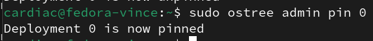
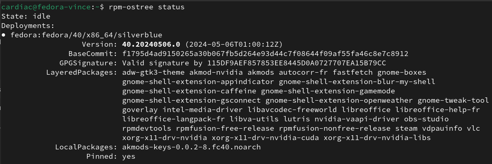
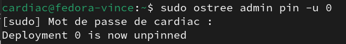
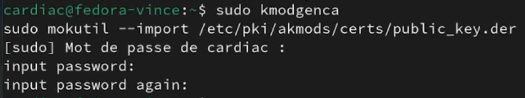
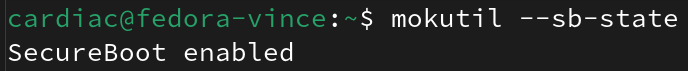

# Configuration de Fedora Silverblue ou Kinoite

[ Fedora Atomic : Introduction ](https://www.youtube.com/watch?v=ik0IsbQUhxY)

[](https://www.youtube.com/watch?v=ik0IsbQUhxY)

## Table des Matières

- **[Flatpak ou RPM ?](#flatpak-ou-rpm)**
- **[Pilotes Nvidia](#pilotes-nvidia)**
- **[AMD & Intel Acceleration Matérielle GPU](#amd-intel-acceleration-matérielle-gpu)**
- **[Installation d'applications avec rpm-ostree](#installation-dapplications-avec-rpm-ostree)**
- **[Installation d'applications avec flatpak](#installation-dapplications-avec-flatpak)**
- **[Flatpak et imprimantes réseau](#flatpak-et-imprimantes-réseau)**
- **[Ajout de Dépôts RPM Fusion](#ajout-de-dépôts-rpm-fusion)**
- **[Firefox avec CODEC](#firefox-avec-codec)**
- **[CODECs divers](#codecs-divers)**
- **[Rebase et pin des déploiements](#rebase-et-pin-des-déploiements)**
- **[Restauration du déploiement (Rollback)](#restauration-du-déploiement-rollback)**
- **[Installation de xpadneo](#installation-de-xpadneo)**
- **[Avoir les Gestes au Pavé Tactile sur Gnome X11](#avoir-les-gestes-au-pavé-tactile-sur-gnome-x11)**
- **[Personnalisation du thème gtk](#personnalisation-du-thème-gtk)**
- **[Installation et Configuration d'OpenRGB](#installation-et-configuration-dopenrgb)**
- **[Steam Flatpak](#steam-flatpak)**
- **[Secureboot](#secureboot)**
- **[Multi boot](#multi-boot)**
- **[Assurez-vous que TRIM fonctionne](#assurez-vous-que-trim-fonctionne)**
- **[Fixer les entrées en doubles dans Gurb](#fixer-les-entrées-en-doubles-dans-gurb)**
- **[Guides divers](#guides-divers)**
- **[Dépannage et Conseils](#dépannage-et-conseils)**
--- 

<br>

## Flatpak ou RPM 

La décision d'utiliser Flatpak ou des paquets RPM sur Fedora Silverblue/Kinoite dépend largement de vos préférences personnelles, car chaque méthode présente ses propres avantages et inconvénients.

- **Paquets RPM** : Installés avec `rpm-ostree install`, les paquets RPM sont intégrés directement dans le système. L'installation ou la mise à jour de paquets RPM nécessite un redémarrage du système pour être effective, en raison du caractère immuable de ces distributions. Cela peut être perçu comme une contrainte, surtout si vous recherchez une flexibilité et une mise à jour rapide de vos applications. Les paquets RPM sont officiellement fournis par Fedora, ce qui peut offrir une certaine assurance quant à leur qualité et leur suivi.

- **Flatpak** : Installés par Gnome Logiciel / Discover ou commande `flatpak install`. Cette méthode offre souvent des versions d'applications plus récentes et une isolation par rapport au système, ce qui peut améliorer la stabilité et la compatibilité des applications ainsi que augmenter la protection de votre vie privée. Cependant, l'utilisation de Flatpak peut exiger une gestion manuelle des permissions, par exemple pour permettre à une application comme Steam d'accéder à un second disque dur. Bien que Flatpak puisse offrir une plus grande flexibilité et des mises à jour plus fréquentes, certains paquets sont maintenus par la communauté et peuvent donc être sujets à des problèmes de suivi ou être abandonnés.

--- 

<br>

## Ajout de Dépôts RPM Fusion

Indispensable pour beaucoup de choses dont *Nvidia* ou les codecs :

La première fois que vous installez les dépôts RPM Fusion, vous devez installer les RPM versionnés :

```bash
sudo rpm-ostree install --apply-live \
    https://mirrors.rpmfusion.org/free/fedora/rpmfusion-free-release-$(rpm -E %fedora).noarch.rpm \
    https://mirrors.rpmfusion.org/nonfree/fedora/rpmfusion-nonfree-release-$(rpm -E %fedora).noarch.rpm
```

Exécuter la commande suivante pour retirer le "verrou" sur les paquets versionnés qui ont été installés précédemment. Cela permettra aux dépôts RPM Fusion d'être mis à jour automatiquement et d'être correctement versionnés à travers les changements majeurs de version de Fedora :

```bash
sudo rpm-ostree update \
    --uninstall rpmfusion-free-release \
    --uninstall rpmfusion-nonfree-release \
    --install rpmfusion-free-release \
    --install rpmfusion-nonfree-release

reboot
```
---
## Pilotes Nvidia
> [!IMPORTANT]
>  Quel que soit le DE et la distribution, restez sur *X11* au moins jusqu'à ce que ce patch arrive dans votre distro. : [explicit-sync](https://gitlab.freedesktop.org/xorg/xserver/-/merge_requests/967),
>  Désactivez le secureboot dans le BIOS/UEFI de l'ordinateur pour permettre l'installation des modules [DKMS](https://wiki.archlinux.org/title/Dynamic_Kernel_Module_Support_(Fran%C3%A7ais)), essentiels pour les pilotes Nvidia mais aussi par exemple pour Xpadneo bien utile pour les manettes Xbox recentes, ou suivre le tuto un peu plus loin, pour activer le secureboot.

**Script pour automatiser l'instalation des drivers Nvidia :**
```bash
git clone https://codeberg.org/Gaming-Linux-FR/post-install-silverblue-kinoite.git ~/post-install-silverblue-kinoite && cd ~/post-install-silverblue-kinoite && chmod +x ./nvidia.sh && sudo ./nvidia.sh
```

**Si vous préférez le faire vous même suivez les étapes suivantes :**

- Ajout du driver et des options kernel
```bash
sudo rpm-ostree install akmod-nvidia xorg-x11-drv-nvidia xorg-x11-drv-nvidia-cuda xorg-x11-drv-nvidia-libs nvidia-vaapi-driver libva-utils vdpauinfo
sudo rpm-ostree kargs --append=rd.driver.blacklist=nouveau --append=modprobe.blacklist=nouveau --append=nvidia-drm.modeset=1
```

- Suppression de l'Option `nomodeset`

Si vous suspectez que l'option `nomodeset` est activée (ce qui peut entraver le bon fonctionnement des pilotes graphiques Nvidia), vous pouvez la supprimer en exécutant :

```bash
sudo rpm-ostree kargs --delete=nomodeset
```

Si le système retourne le message suivant :

```
error: No key 'nomodeset' found
```

Cela signifie que l'option `nomodeset` n'était pas activée, *ce qui est l'état souhaité* pour garantir une compatibilité optimale avec les pilotes Nvidia.

--- 

<br>

## AMD & Intel Acceleration Matérielle GPU

- INTEL

```bash
rpm-ostree override remove mesa-va-drivers \
--install mesa-va-drivers-freeworld \
--install intel-media-driver
```

- AMD

```bash
rpm-ostree override remove mesa-va-drivers \
--install mesa-va-drivers-freeworld \
```

--- 

<br>

## Installation d'applications avec rpm-ostree

La commande est : ``rpm-ostree install nomdespaquets`` exemple :

```bash
sudo rpm-ostree install fastfetch lutris goverlay wine steam vlc obs-studio
```
**[Steam](https://codeberg.org/Gaming-Linux-FR/steam-post-install)** : Guide de post-installation pour Steam

--- 

<br>

## Installation d'applications avec flatpak

Vous pouvez simplement passer par *Gnome logiciel* sur Silverblue ou *Discover* sur Kinoite. Attention de bien selectionner la source flathub en haut à droite.

--- 

<br>

### Flatpak et imprimantes réseau

La plus part des Flatpaks : Libre Office, Firefox, Brave, Onmy Office, bloquent les imprimantes réseau par défaut.
Le plus simple et d'utiliser `Flatseal` et de leur donner accés à `Bus session D-Bus` (socket=session-bus) `Bus système D-Bus`(socket=system-bus) et `Système d'impression`(socket=cups)

--- 

<br>

## Firefox avec CODEC

Pour assurer la prise en charge complète des codecs dans Firefox sur Fedora Silverblue/Kinoite, permettant ainsi la lecture de toutes les vidéos.

**Première solution**, suivez ces étapes pour remplacer la version par défaut de Firefox par celle disponible via Flatpak de Flathub :

1. **Supprimez Firefox installé par défaut** :
    - Exécutez la commande suivante pour retirer Firefox et ses paquets de langues associés du système :
        ```bash
        rpm-ostree override remove firefox firefox-langpacks
        ```

2. **Installez Firefox via Flatpak** :
    - Ouvrez **Gnome Software** ou **Discover**.
    - Recherchez **Firefox**.
    - Assurez-vous de sélectionner la version provenant de **Flathub** et non celle du dépôt Fedora.
    - Cliquez sur **Installer** pour procéder à l'installation.

Cette méthode vous permet d'accéder à une version de Firefox intégrant nativement le support étendu des codecs, indispensable pour une expérience de navigation optimale, notamment pour la lecture vidéo. Opter pour la version Flatpak de Flathub garantit également que vous bénéficiez des mises à jour directes de l'application, indépendamment des cycles de mise à jour du système d'exploitation.

**Seconde solution**, si vous préférez rester sur le Firefox rpm, installer le paquet `libavcodec-freeworld`, il devrait suffire pour la plus part des usages. Il faut avoir préalablement activé les dépots rpm-fusion.

```sh
sudo rpm-ostree install --apply-live libavcodec-freeworld
```

--- 

<br>

## Codecs Divers

### Support HEIF et AVIF

Cette commande installe les paquets nécessaires pour ajouter le support des formats HEIF et AVIF, permettant ainsi la visualisation et la manipulation de ces types de fichiers sur votre système.

```bash
rpm-ostree install heif-pixbuf-loader \
                   libheif-freeworld \
                   libheif-tools
```

### Ajout du codec Bluetooth AptX

Installez le codec AptX pour Pipewire, améliorant ainsi la qualité de l'audio sur les appareils Bluetooth supportant ce codec.

```bash
rpm-ostree install pipewire-codec-aptx
```

--- 

<br>

## Rebase et pin des déploiements

1. `rpm-ostree rebase` permet de passer d'une Fedora Atomic à une autre.

Passer sur Silverblue 40 qui est au moment ou j'écris ses lignes en phase de testing :
```bash
rpm-ostree rebase fedora:fedora/40/x86_64/silverblue
```
- Pour revenir à Silverblue 39 l'actuelle release : `rpm-ostree rebase fedora:fedora/39/x86_64/silverblue`

Pour Kinoite : 

- Pour passer à Kinoite 40 : `rpm-ostree rebase fedora:fedora/40/x86_64/kinoite`
- Pour revenir à Kinoite 39 : `rpm-ostree rebase fedora:fedora/39/x86_64/kinoite`

Pour les versions de développement remplacer le numéro de version par rawhide :

exemples :

- Pour passer à Kinoite Rawhide    : `rpm-ostree rebase fedora:fedora/rawhide/x86_64/kinoite`
- Pour passer à Silverblue Rawhide : `rpm-ostree rebase fedora:fedora/rawhide/x86_64/silverblue`

On peut passer de Kinoite à Silverblue sans problème, il faut juste reboot après une rebase. Si jamais il y a un problème on peut booter sur l'ancienne entrée et rollback pour la repasser en entrée principale.

2. On peut aussi "Pin" un déploiement

`ostree admin pin` permet de fixer un déploiement spécifique pour empêcher qu'il ne soit supprimé lors des mises à jour futures du système. Cela est utile pour maintenir une configuration stable tout en explorant des versions plus récentes ou des déploiements de test sans risque de perdre l'accès à une version fiable et bien configurée.

Avec `sudo ostree admin pin 0` on pin le déploiement actuel et avec `sudo ostree admin pin 1` le précédent.





Avec `sudo ostree admin pin -u 0` on dé pin le dépoiment 0, `sudo ostree admin pin -u 1` le 1 etc.



--- 

<br>

## Restauration du déploiement (Rollback)
- **Temporaire** : Redémarrez et sélectionnez la version précédente dans le menu de démarrage.
- **Permanent** : Utilisez `sudo rpm-ostree rollback` sur le déploiement que vous voulez garder et mettre en priorité au boot.

--- 

<br>

## Installation de [xpadneo](https://github.com/atar-axis/xpadneo)

Ces étapes vous permettront d'installer le pilote `xpadneo` sur Fedora Silverblue, offrant une meilleure expérience d'utilisation des manettes Xbox récentes.

1. **Ajout du dépôt COPR** :
    - Exécutez la commande suivante pour ajouter le dépôt COPR de `xpadneo` :
        ```bash
        sudo wget -O /etc/yum.repos.d/_copr:copr.fedorainfracloud.org:shdwchn10:xpadneo.repo https://copr.fedorainfracloud.org/coprs/shdwchn10/xpadneo/repo/fedora-$(rpm -E %fedora)/shdwchn10-xpadneo-fedora-$(rpm -E %fedora).repo
        ```

2. **Installation de xpadneo** :
    - Utilisez ensuite cette commande pour installer le pilote `xpadneo` :
        ```bash
        rpm-ostree install xpadneo
        ```
Comme pour Nvidia, le *sécure boot doit être désactivé* dans le bios car c'est un [DKMS](https://wiki.archlinux.org/title/Dynamic_Kernel_Module_Support_(Fran%C3%A7ais))

## Avoir les Gestes au Pavé Tactile sur Gnome X11

Les utilisateurs préférant rester encore un peu sur X11 peuvent améliorer leur expérience en activant les gestes tactiles, ce qui rend la navigation et l'interaction avec le système d'exploitation plus intuitives et fluides.

1. **Installation de Touchégg** :
    - Touchégg est une application qui transforme les gestes sur le pavé tactile en actions. Pour l'installer, utilisez la commande suivante :
        ```bash
        rpm-ostree install touchegg
        ```
    - Après l'installation, redémarrez votre système pour appliquer les changements :
        ```bash
        systemctl reboot
        ```
    - Activez ensuite le service Touchégg pour qu'il démarre automatiquement avec le système :
        ```bash
        systemctl enable --now touchegg
        ```

2. **Installation de l'Extension Gnome X11 Gestures** :
    - Pour une intégration parfaite avec Gnome sous X11, installez l'extension Gnome X11 Gestures. Visitez la page de l'extension sur le site des extensions Gnome à l'adresse suivante et activez-la : [X11 Gestures sur extensions.gnome.org](https://extensions.gnome.org/extension/4033/x11-gestures/).

--- 

<br>

## Personnalisation du thème gtk

**Uniquement utile sur SILVERBLUE**

Pour personnaliser l'apparence de votre Fedora Silverblue avec le thème Adw-gtk3, suivez ces étapes :

1. **Installation du Gnome Tweak Tool et du Thème Adw-gtk3** :
    ```bash
    sudo rpm-ostree install gnome-tweak-tool adw-gtk3-theme
    ```

2. **Installation des Thèmes Flatpak Adw-gtk3** :
    ```bash
    flatpak install org.gtk.Gtk3theme.adw-gtk3 org.gtk.Gtk3theme.adw-gtk3-dark
    ```

3. **Application du Thème** :
    - Ouvrez **Ajustements** (présent dans le dossier **Utilitaires** de GNOME).
    - Naviguez jusqu'à l'onglet **Apparence**.
    - Sélectionnez **Adw-gtk3** dans la section **Anciennes applications** pour appliquer le thème.

Ces étapes vous permettront de bénéficier d'une interface utilisateur modernisée et cohérente, grâce à l'application du thème Adw-gtk3 sur votre système.

--- 

<br>

## Installation et Configuration d'[OpenRGB](https://openrgb.org)

OpenRGB est un outil permettant de contrôler l'éclairage RGB de divers périphériques.

1. **Installation des règles udev pour OpenRGB** :
    - Ceci est nécessaire pour permettre à OpenRGB de communiquer correctement avec votre matériel sans nécessiter de permissions root.
        ```bash
        sudo rpm-ostree install openrgb-udev-rules
        ```

2. **Installation d'OpenRGB via Flatpak** :
    - Pour installer l'application OpenRGB.
        ```bash
        flatpak install org.openrgb.OpenRGB
        ```

3. **Création d'un Profil OpenRGB** :
    - Après l'installation, lancez OpenRGB et configurez vos paramètres RGB. Enregistrez ces paramètres sous un profil nommé, par exemple, "fedora".

4. **Ajout d'OpenRGB au Démarrage** :
    - Ouvrez **Ajustements** dans GNOME.
    - Allez dans l'onglet **Applications au démarrage**.
    - Cliquez sur **+** et choisissez **OpenRGB** pour l'ajouter à la liste des applications lancées au démarrage de l'ordinateur.

5. **Configuration du Lancement Automatique du Profil** :
    - Pour que OpenRGB lance automatiquement votre profil "fedora" au démarrage de l'ordinateur et en mode minimisé, créez ou modifiez le fichier de lancement automatique :
        ```bash
        nano ~/.config/autostart/org.openrgb.OpenRGB.desktop
        ```
    - Remplacez la ligne existante commençant par `Exec=` avec :
        ```
        Exec=/usr/bin/flatpak run --branch=stable --arch=x86_64 --command=openrgb org.openrgb.OpenRGB --startminimized --profile "fedora"
        ```
    - Sauvegardez et fermez l'éditeur. Cette configuration permettra à OpenRGB de démarrer en arrière-plan avec les paramètres de votre profil "fedora" chaque fois que vous allumerez votre ordinateur.

--- 

<br>

## Steam Flatpak
Installation de Steam, configuration pour un démarrage en mode minimisé et ajout d'une bibliothèque de jeux sur un second disque.

### Installation de Steam et Configuration des Périphériques

1. **Installation des pilotes de périphériques pour Steam** :
    - Cette étape assure que tous les périphériques nécessaires pour Steam (comme les contrôleurs de jeu) fonctionnent correctement.
        ```bash
        sudo rpm-ostree install steam-devices
        ```

2. **Installation de Steam via Flatpak** :
    - Pour installer la version Flatpak de Steam, qui offre une meilleure intégration et isolation sur Fedora Silverblue et Kinoite.
        ```bash
        flatpak install com.valvesoftware.Steam
        ```

### Lancement Automatique de Steam en Mode Minimisé

1. **Configuration du démarrage automatique** :
    - Pour que Steam démarre automatiquement à l'ouverture de session, en mode minimisé, modifiez le fichier de démarrage automatique :
        ```bash
        nano ~/.config/autostart/com.valvesoftware.Steam.desktop
        ```
    - Ajoutez " -silent " entre %U et @@ dans la ligne `Exec=`, afin qu'elle ressemble à ceci :
        ```
        Exec=/usr/bin/flatpak run --branch=stable --arch=x86_64 --command=/app/bin/steam --file-forwarding com.valvesoftware.Steam @@U %U -silent @@
        ```
    - Cette modification permet de lancer Steam automatiquement en arrière-plan, sans fenêtre de démarrage.

### Ajout d'un Second Disque de Jeux

1. **Configuration de l'accès à un second disque** :
    - Si vous souhaitez ajouter un second disque dur ou SSD pour votre bibliothèque de jeux Steam, vous devez accorder à Steam l'accès à ce disque via une surcharge Flatpak :
        ```bash
        flatpak override --user --filesystem=/chemin/vers/votre/Bibliothèque/Steam com.valvesoftware.Steam
        ```
    - Remplacez `/chemin/vers/votre/Bibliothèque/Steam` par le chemin réel vers votre dossier de bibliothèque Steam sur le second disque.

--- 

<br>

## Secureboot

**Le secureboot fonctionne très bien sur Fedora sans faire ce qui suit, ce qui suit n'est utile que avec les drivers Nvidia propriétaires ou autre DKMS comme Xpadneo par exemple.**

Le Secureboot est une fonctionnalité de sécurité du firmware UEFI qui assure que seuls les logiciels autorisés peuvent être lancés au démarrage de l'ordinateur, empêchant ainsi le chargement de logiciels malveillants.

Désactivez le secureboot avant ces opérations :

Installation des dépendances nécessaires au Secure Boot :
```
rpm-ostree install --apply-live rpmdevtools akmods
```
Génération de votre clé :

 ```
sudo kmodgenca
sudo mokutil --import /etc/pki/akmods/certs/public_key.der
```

À cette étape on va vous demander un mot de passe à usage unique qu'il faudra entrer une seule fois au reboot. Celui-ci ne servira plus jamais et n'a aucune influence sur le niveau de sécurité. Mettez donc un mot de passe très simple surtout qu'au redémarrage, au moment de saisir le mot de passe, vous serez en querty et non en azerty. Vous pouvez même mettre une seule lettre, en pensant bien que au redémarrage vous êtes en querty donc si vous mettez `a` faudra mettre `q`.



Téléchargement du script d'installation :
```
git clone https://codeberg.org/Gaming-Linux-FR/post-install-silverblue-kinoite.git
cd post-install-silverblue-kinoite/secureboot
```
Construction de la clé Secure Boot :
```
sudo bash setup.sh
rpm-ostree install akmods-keys-0.0.2-8.fc$(rpm -E %fedora).noarch.rpm
```

Après cela, nous redémarrons, activons le Secure Boot dans le BIOS, et nous serons accueillis par un bel écran bleu. Il faudra alors procéder comme suit, regardez la vidéo : 

- Enroll MOK
- Continue 
- Se rappeler que on est en qwerty et pas azerty
- Entrer le mot de passe à utilisation unique choisi précédemment.

Si jamais l'installation du Secure Boot interrompt le fonctionnement de certains logiciels, comme par exemple xpadneo ou le driver Nvidia, il suffira de les réinstaller.

```
rpm-ostree remove xpadneo
systemctl reboot
```
Réinstallation :
```
rpm-ostree install xpadneo
systemctl reboot
```

Pour vérifier que le sécureboot est actif : `mokutil --sb-state`



---

## Multi Boot

Comment ajouter une entrée dans le grub pour vos autres OS.

Détecter les autres OS :

```sh
sudo os-prober
```

Puis les ajouter au grub :

```sh
sudo grub2-mkconfig -o /boot/grub2/grub.cfg
```

Et voilà en 2 commandes vous retrouverez vos autres systèmes d'exploitation dans le grub de Kinoite / Silverblue.

--- 

<br>

# Assurez-vous que TRIM fonctionne

J'ai remarqué que je n'avais pas le trim d'activé, j'ai trouvé la solution dans ce guide https://lurkerlabs.com/fedora-silverblue-ultimate-post-install-guide/

En voici la traduction : 

## Vérifiez si TRIM est activé

Si vous avez installé Fedora Silverblue/Kinoite sur un SSD et que vous avez choisi de chiffrer vos données lors de l'installation, il faut vérifier si le TRIM est activé.

### Tester manuellement TRIM :

Vous pouvez vérifier manuellement en exécutant la commande suivante :

```bash
sudo fstrim /
```

Cette commande pourrait retourner un message d'erreur. Si c'est le cas nous allons voir par la suite comment résoudre le problème.

### Explication :

Par défaut, les systèmes de fichiers chiffrés LUKS ne supportent pas le passage des requêtes de "discard" du TRIM pour des [raisons de sécurité](https://asalor.blogspot.com/2011/08/trim-dm-crypt-problems.html). Pourtant, pour la plupart des utilisateurs, les avantages de TRIM surpassent ces préoccupations de sécurité.

### Problème avec Silverblue/Kinoite :

Contrairement à Fedora Workstation, Silverblue ne semble pas analyser le fichier crypttab dans l'image initramfs utilisée pour démarrer le noyau. Il y a [un rapport de bug](https://bugzilla.redhat.com/show_bug.cgi?id=1801539) ouvert à ce sujet.

#### Solution :

```bash
rpm-ostree kargs --append=rd.luks.options=xxxxxxxx-xxxx-xxxx-xxxx-xxxxxxxxxxxx=discard
```
Il faut bien entendu remplacer "xxxxxxx-xxxx-xxxx-xxxx-xxxxxxxxxxxx" par votre clé que vous pouvez récuperer dans `sudo cat /etc/crypttab`

### Redémarrage et vérification :

Après un redémarrage, `sudo fstrim /` devrait fonctionner correctement.

--- 

<br>

### Fixer les entrées en doubles dans Gurb

```bash
sudo grub2-switch-to-blscfg
sudo grub2-mkconfig -o /etc/grub2.cfg
```

--- 

<br>

## Guides divers

- **[GLF ASTUCES](/Gaming-Linux-FR/glf-astuces//#readme)** : Astuces diverses, ne concernant pas une distribution spécifique.
- **[Formater et monter un disque](/Gaming-Linux-FR/guide-formater-monter)** : Formater et monter au démarrage ses disques / SSD internes sur Linux

## Dépannage et Conseils

Ce guide vise à offrir une introduction complète à l'utilisation de Ubuntu pour le gaming et le multimédia. Pour des problèmes spécifiques, n'hésitez pas à rejoindre notre discord : 

[](https://discord.gg/WCAKxxRA3t)

Ce guide est destiné à être régulièrement mis à jour. Vos retours et contributions sont les bienvenus pour aider à enrichir cette ressource et assister d'autres utilisateurs dans leur expérience Ubuntu.